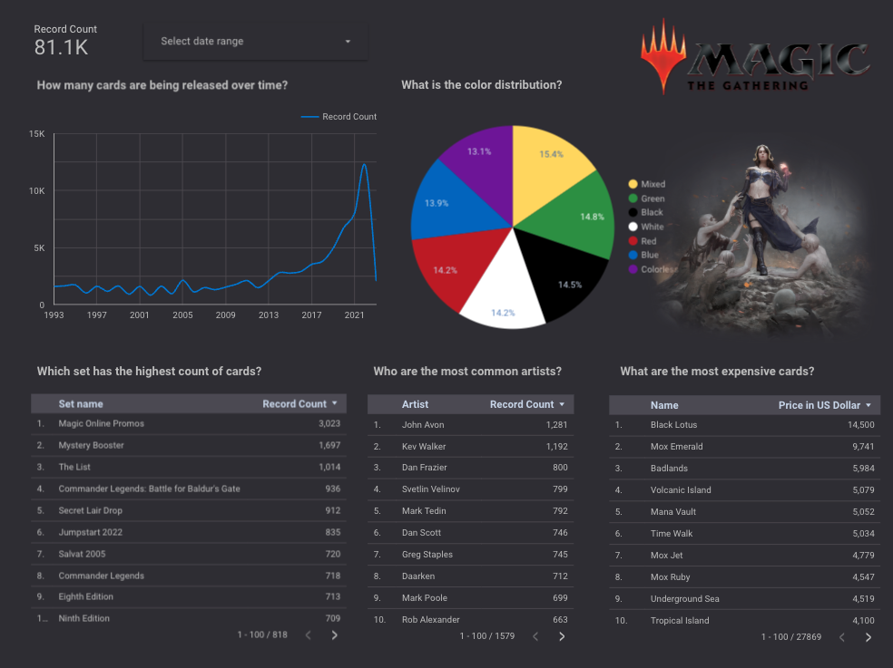

<b>TL;DR</b>: This project is analyzing MGT card data. Follow the steps mentioned under `How to make it work?` to set it up.

## What is this about?
If you have never seen the logo above, here a very quick intro: `Magic: The Gathering` (Magic or MGT) is the first collectible card game of its kind, created in 1993. It can be played be two or more players. The exact rules differ a bit by the exact format but in general: players battle against each other with their card decks, trying to defeat the other players by casting spells, artifacts and creatures. Curious? [Learn how to play...](https://magic.wizards.com/en/intro)

<p align="center">

</p>

## What questions are we trying to answer? 
This project looks at MGT from a meta-perspective and dives into the following:
1. How many cards are being released over time?
2. What is the color distribution?
3. Which set has the highest count of cards?
4. Who are the most common artists? 
5. What are the most expensive cards?

## What technologies are being used?
- Cloud: [Google Cloud](https://cloud.google.com)
- Infrastructure: [Terraform](https://www.terraform.io/)
- Orchestration: [Prefect](https://www.prefect.io/)
- Data lake: [Google Cloud Storage](https://cloud.google.com/storage)
- Data transformation: [DBT](https://www.https://getdbt.com/)
- Data warehouse: [BigQuery](https://cloud.google.com/bigquery)
- Data visualization: [Google Looker Studio](https://cloud.google.com/looker), former Data Studio

## Dashboard example
<p align="left">


</p>

## What is the structure of the production table?
| Column | Description | 
|--------|-------------|
| primary_key | Unique surrogate key from card_id and released_at data |
| card_id | Card ID in database, IDs can be repeated due to reprintings |
| name | The name of this card |
| released_at | The date this card was first released |
| color_identity | This card’s color identity |
| color_category | Based on the color_identity: Black, Blue, White, Green, Red, Colorless or Mixed |
| set_name | This card’s full set name |
| artist | The name of the illustrator of this card face |
| price | Price information of this card in US Dollar |
| data_update | Timestamp when the data was updated in the database |

- The table used for visualization is `dbt_mtg_latest_data` 
- Here the dbt lineage graph 
- Partitioned on the `released_at` column - in favor of question 1 and 3 - assuming that in most cases, cards with the same release date are from the same set
- Clustered on the `color_category` column - in favor of question 2 - assuming that within one set the number of colors is lower than the numbers of unique prices and artists


<p align="center">

</p>

## How to make it work?
1. Setup your Google Cloud environment
- Create a [Google Cloud Platform project](https://console.cloud.google.com/cloud-resource-manager)
- Configure Identity and Access Management (IAM) for the service account, giving it the following privileges: BigQuery Admin, Storage Admin and Storage Object Admin
- Download the JSON credentials and save it to `~/.gc/<credentials>`
- Install the [Google Cloud SDK](https://cloud.google.com/sdk/docs/install-sdk)
- Let the [environment variable point to your GCP key](https://cloud.google.com/docs/authentication/application-default-credentials#GAC), authenticate it and refresh the session token
```bash
export GOOGLE_APPLICATION_CREDENTIALS=<path_to_your_credentials>.json
gcloud auth activate-service-account --key-file $GOOGLE_APPLICATION_CREDENTIALS
gcloud auth application-default login
```
2. Install all required dependencies into your environment
```bash
pip install -r requirements.txt
```
3. Setup your infrastructure
- Assuming you are using Linux AMD64 run the following commands to install Terraform - if you are using a different OS please choose the correct version [here](https://developer.hashicorp.com/terraform/downloads) and exchange the download link and zip file name below

```bash
sudo apt-get install unzip
cd ~/bin
wget https://releases.hashicorp.com/terraform/1.4.1/terraform_1.4.1_linux_amd64.zip
unzip terraform_1.4.1_linux_amd64.zip
rm terraform_1.4.1_linux_amd64.zip
```
- To initiate, plan and apply the infrastructure run the following Terraform commands: 
```bash
cd terraform/
terraform init
terraform plan -var="project=<your-gcp-project-id>"
terraform apply -var="project=<your-gcp-project-id>"
```
4. Setup your orchestration
- If you do not have a prefect workspace, sign-up for the prefect cloud and create a workspace [here](https://app.prefect.cloud/auth/login)
- Create the prefect blocks via UI or adjust the variables in `/prefect/prefect_blocks.py` and run
```bash
python magic-the-gathering/prefect/prefect_blocks.py
```
- To schedule the data ingestion job on a weekly basis - every Saturday at midnight - run the following
```bash
prefect deployment build prefect/api_to_gcs_to_bq.py:api_to_bq_orchestration -n "scryfall-api-to-gcs-to-bq" --cron "0 0 * * SAT" -q default --param dataset="default_cards" -a
```
5. Setup your tables for visualization
- DBT part

6. Data deep dive
- The data will be available in BigQuery at `mtg_card_data_dbt.dbt_mtg_latest_data` 
- Query the data in-place or build a nice dashboard in Looker

<p align="center">


</p>

## Potential next steps
With a growing database, we would be able to further explore the following:
- What is the color distribution over time?
- What is the price development of specific cards / colors / sets over time?

<p align="center">

</p>

# To do

## Setup
- [x] Describe what MTG is
- [x] Clear problem description and clear description of the solution
- [x] Mention Scryfall, [Logo](https://static.wikia.nocookie.net/mtgsalvation_gamepedia/images/a/a2/Scryfall.jpg/revision/latest/scale-to-width-down/180?cb=20221220021533)
- [x] Mention Magic: The Gathering [lotus](https://static.wikia.nocookie.net/mtgsalvation_gamepedia/images/e/e6/Site-logo.png/revision/latest?cb=20210621093849) [logo](https://www.google.com/url?sa=i&url=https%3A%2F%2Fde.m.wikipedia.org%2Fwiki%2FDatei%3AMagicthegathering-logo.svg&psig=AOvVaw1ITUEgWPlwcDb6HN93f5dR&ust=1678264036225000&source=images&cd=vfe&ved=0CBAQjRxqFwoTCKiMx--yyf0CFQAAAAAdAAAAABAE)
- [x] instructions on how to run the code
- [x] Setup terraform
- [x] Cloud development
- [x] Save [pictures](https://github.com/jupyter/notebook/issues/3278) to github repository
- [] Test on new account (Anto)

## Data ingestion
- [x] Download data from API
- [x] upload to GCS
- [x] Orcehstration with Prefect
- [x] Saving to parque directly on GCS
- [] Schedule weekly with prefect
- [] Schedule weekly +1 day with DBT, with Prefect?
- [] Add to readme

## Lake to warehouse
- [x] From GCS to BQ

## Transformation
- [x] Partitioning and clustering in dbt

## Visaulization
- [x] DataStudio Dashboard
- [x] How many cards are being released over time?
- [x] What is the average amount of cards per set?
- [x] Who are the most common illustrators? 
- [x] What are the most expensive cards?

## Extra mile
- [] Tests
- [] CI / CD pipeline
